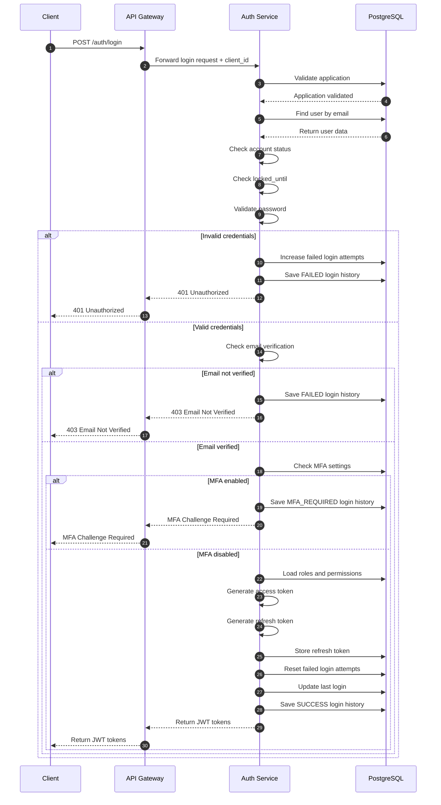

# Login Flow

## Purpose

Authenticate users and generate JWT tokens securely for ecosystem applications.

---

# Flow Diagram

---

# Main Flow

1. Client sends login request with email and password
2. API Gateway forwards request to Auth Service together with `client_id`
3. Auth Service validates the target application
4. System retrieves user information from database
5. System checks:
    - account status
    - temporary lock state
    - password validity
6. System verifies email status
7. System checks MFA configuration
8. System loads user roles and permissions
9. System generates:
    - access token
    - refresh token
10. Refresh token is stored securely
11. Login history is saved
12. JWT tokens are returned to client

---

# Alternative Flows

## Invalid Credentials

- Password validation fails
- Failed login attempts are increased
- Failed login history is recorded
- Unauthorized response is returned

---

## Account Locked

- System detects locked account
- Authentication request is rejected
- Account locked response is returned

---

## Email Not Verified

- User email is not verified
- Authentication request is denied
- Verification required response is returned

---

## MFA Required

- MFA is enabled for the user
- MFA challenge is triggered
- User must complete OTP verification before receiving JWT tokens

---

# Database Interaction

| Action | Table |
|---|---|
| Validate application | applications |
| Find user | users |
| Update failed attempts | users |
| Update login information | users |
| Load user roles | user_roles |
| Load permissions | role_permissions |
| Store refresh token | refresh_tokens |
| Save login history | login_histories |
| Check MFA settings | mfa_settings |

---

# Security Notes

- Passwords are verified using BCrypt
- JWT tokens are securely signed
- Access tokens are short-lived
- Refresh tokens are persisted securely
- Failed login attempts are tracked
- Temporary account locking is supported
- MFA authentication is supported
- Role and permission claims can be embedded into JWT
- Refresh token revocation is supported
- Login history is recorded for audit and monitoring

---

# Token Configuration

| Token Type | Expiration |
|---|---|
| Access Token | 15 minutes |
| Refresh Token | 7 days |

---

# HTTP Response Codes

| Status Code | Description |
|---|---|
| 200 | Login successful |
| 401 | Invalid credentials |
| 403 | Email not verified |
| 423 | Account locked |
| 428 | MFA required |

---

# Related APIs

- `POST /auth/login`
- `POST /auth/refresh`
- `POST /auth/logout`
- `POST /auth/mfa/verify`

---

# Architecture Notes

This authentication flow supports:

- Centralized authentication
- Multi-application ecosystem
- RBAC authorization model
- MFA authentication
- OAuth account linking
- Security auditing
- Token-based authentication
- Session management
- Microservice architecture
