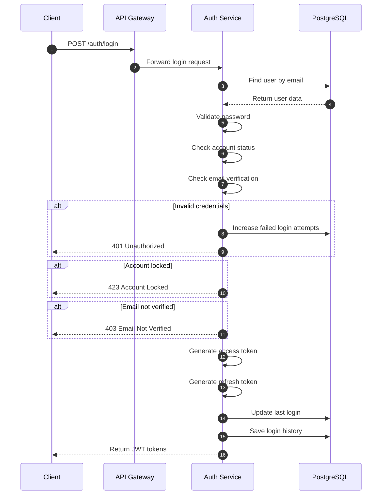

# Login Flow

## Purpose

Authenticate users and generate JWT tokens for accessing ecosystem applications securely.

---

## Flow Diagram



---

## Main Flow

1. Client sends login request with email and password
2. API Gateway forwards request to Auth Service
3. Auth Service retrieves user information from database
4. System validates password using BCrypt
5. System checks account status and email verification
6. System generates access token and refresh token
7. Login history is stored
8. JWT tokens are returned to client

---

## Alternative Flows

### Invalid Credentials

- Password validation fails
- Failed login attempts are increased
- Unauthorized response is returned

### Account Locked

- System detects locked account
- Login request is rejected

### Email Not Verified

- User account email is not verified
- Authentication request is denied

---

## Database Interaction

| Action | Table |
|---|---|
| Find user | users |
| Update login information | users |
| Save login history | login_histories |

---

## Security Notes

- Passwords are verified using BCrypt
- JWT tokens are signed securely
- Access token expiration: 15 minutes
- Refresh token expiration: 7 days
- Failed login attempts are tracked
- Locked accounts cannot authenticate

---

## Related APIs

- `POST /auth/login`
- `POST /auth/refresh`
- `POST /auth/logout`
```